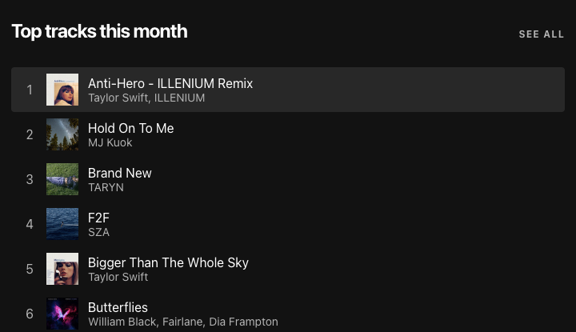

# Spotify Profile
  
  ## Description
  This app allows you to get your Spotify top artists and tracks, and sort your playlists by things like energy and danceability. This was built with The Spotify API, React, Express, and Axios. 


  


## Installation

1. Register a Spotify App in your [Spotify Developer Dashboard](https://developer.spotify.com/dashboard/) and add `http://localhost:8888/callback` as a Redirect URI in the app settings

2. Create a `.env` file at the root of the project based on `.env.example` and add your unique `CLIENT_ID` and `CLIENT_SECRET` from the Spotify dashboard

3. Ensure [nvm](https://github.com/nvm-sh/nvm) and [npm](https://www.npmjs.com/) are installed globally

4. Install the correct version of Node

    ```shell
    nvm install
    ```

5. Install dependencies

    ```shell
    npm install
    ```

6. Run the React app on <http://localhost:3000> and the Node server on <http://localhost:8888>

    ```shell
    npm start
    ```

## Credits

This app was built following a tutorial by Brittany Chiang. (https://www.newline.co/courses/build-a-spotify-connected-app)

  ## License
    
  This project uses  the [MIT](https://opensource.org/licenses/MIT) license.


  ## Questions
  Reach out via email or GitHub.  
  cassie.s.simpson@gmail.com  
  [cassie-s](https://github.com/cassie-s/)
